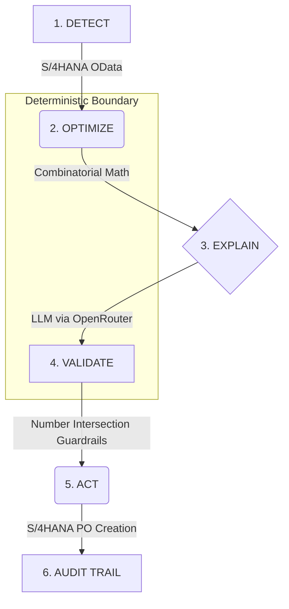

# RESILIENCE OS

**Supply-chain disruption recovery system powered by a strictly separated Deterministic Decision Layer and AI Narrative Layer.**

## The Pitch
When a supply chain breaks, executives need immediate recovery plans they can trust with millions of dollars. Current GenAI tools fail this test because they hallucinate numbers and cannot guarantee optimal combinatorial logic. **Resilience OS** solves this by strictly separating the brain from the mouth. A pure mathematical engine calculates the absolute best supplier combinations based on cost, delay, and SLA exposure. Then, an LLM explains this decision to the human. Finally, a deterministic Guardrail strips any number out of the LLM's response that cannot be explicitly traced back to the raw source data. The result? 100% mathematically optimal decisions, delivered in natural language, with a mathematical guarantee against hallucinations.

## Architecture Pipeline



## Running the Live Demo
Use the `demo_end_to_end.py` CLI to run the polished terminal presentation.

**Standard Run:**
```bash
python demo_end_to_end.py
```

**Resilience (Chaos) Testing:**
Demonstrate graceful degradation live without touching code:
```bash
python demo_end_to_end.py --inject-failure sap
python demo_end_to_end.py --inject-failure llm
python demo_end_to_end.py --inject-failure guardrails
```

## API Access
Start the FastAPI server to access the OpenAPI Swagger UI:
```bash
uvicorn main:app --reload
```
Navigate to `http://127.0.0.1:8000/docs`.

## Known Limitations / What's Next
- **SAP OData Complexity**: Currently we simulate the `x-csrf-token` flow. In production with BTP Destination Service, OAuth2 SAML Bearer Assertion flows would need to be added to the `sap_adapter.py` HTTP headers.
- **Guardrail Scope**: The guardrail currently validates numerical claims. Future iterations would use a smaller local NLP model to ensure the LLM hasn't hallucinated categorical claims (e.g. "We will use sea freight" when the data says "Air").
